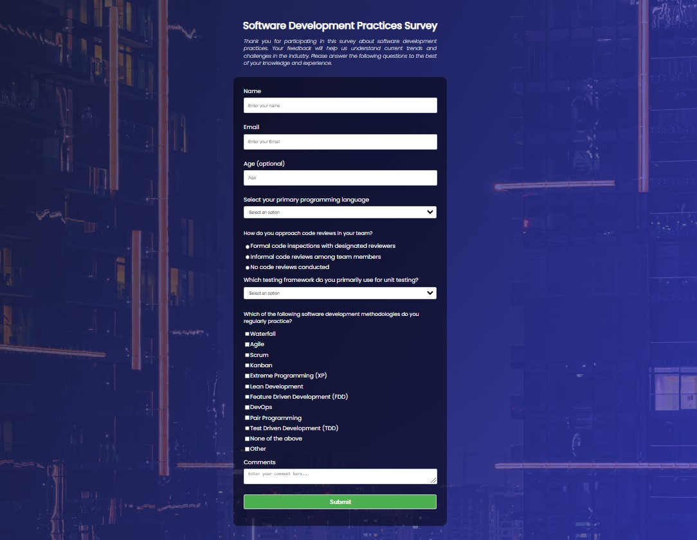

# Single-page survey form 

## Status / License

## Description

A small project that showcases a survey using HTML and CSS.

## Table of Contents

- [Installation](#installation)
- [Usage](#usage)
- [File Structure](#file-structure)
- [Technologies Used](#technologies-used)
- [Contributing](#contributing)
- [License](#license)
- [Credits](#credits)
- [Contact](#contact)

## Installation

To begin experimenting with this project:

Clone the github repository, and open the index.html with your favourite browser.
    
    git clone https://github.com/Exxiler/survey_form_fcc.git

## Usage

After downloading, simply edit the HTML and CSS files.

The survey is interactable, but submitting doesn't work.

## File Structure

Describe the organization of your project's files and folders. Explain the purpose of each file or folder.

     
    /
    |---/assets/img
        |-buildings.jpg
    |-index.html
    |-README.md
    |-Screenshot.jpg
    |-styles.css

## Technologies Used

- HTML
- CSS

## Credits

Inspired by [Free Code Camp](https://www.freecodecamp.org/)

## Contact

[Github](https://github.com/Exxiler)
